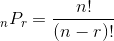
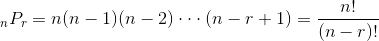
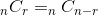
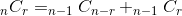
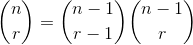
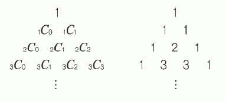

# Abstract

- 이항계수에 대해 적는다. 먼저 순열과 조합을 이해해야 한다.

# Prerequisites

## Permutation

- n개에서 r개를 중복하지 않고 순서를 고려하여 골라내는 방법을 순열이라고 한다. 
  nPr = n x (n-1) x (n-2) x ... x (n-r+1)이다. 따라서 다음과 같은 
  정리를 유도할 수 있다.

```math
_{n}P_{r} = n (n-1) (n-2) \cdot\cdot\cdot (n-r+1) = \frac{n!}{(n-r)!}
```



## Combination

- n개에서 r개를 순서없이 골라내는 방법과 같다. n개에서 r개를 선택하는 순열을
  r개의 순서를 고려한 경우의 수(r!)로 나눈 것과 같다.

```latex
_{n}C_{r} = \frac{_{n}P_{r}}{r!} = \frac{n!}{r!(n-r)!}
```



- n개에서 r개를 선택하는 것은 n개에서 n-r개를 선택하지 않는 것을
  선택하는 것과 가짓수가 같다.

```latex
_{n}C_{r} = _{n}C_{n-r}
```



- n개중 한개를 고정한다. 이제 n개중 r개를 선택하는 가짓수는 그 한개가 있는 경우와
  없는 경우 2가지로 나눠진다. 각각 n-1Cr-1, n-1Cr로 표현할 수 있다. 

```latex
_{n}C_{r} = _{n-1}C_{n-r} + _{n-1}C_{r}
```



## Binomial coefficient

- 이항계수는 조합과 같다.

```latex
\binom{n}{r} = \binom{n-1}{r-1} \binom{n-1}{r}
```



# Implementation

이항계수를 구하기 위해 파스칼의 삼각형, 뤼카의 정리, 나머지 연산자
곱셈의 역원을 이용한 방법 등을 기술한다.

## 파스칼의 삼각형을 이용한 방법

* [Dynamic Programming | Set 9 (Binomial Coefficient) @ geeksforgeeks ](http://www.geeksforgeeks.org/dynamic-programming-set-9-binomial-coefficient/)

파스칼의 삼각형은 다음과 같다. 숫자들과 nCr의 관계를 잘 살펴보자.



다음은 파스칼의 삼각형을 이용하여 이항계수를 구현한 것이다.  트리의
깊이가 곧 n과 같다.  overflow를 막기 위해 나머지 연산자를 이용하였다.
시간복잡도는 O(n^2)이다.

```cpp
// in every line first value is always 0 + 1 pattern
// C[1] = C[1] + C[0] = 0 + 1 = 1
//   C[2] = C[2] + C[1] = 0 + 1 = 1
//   C[1] = C[1] + C[0] = 1 + 1 = 2
//     C[3] = C[3] + C[2] = 0 + 1 = 1
//     C[2] = C[2] + C[1] = 2 + 1 = 3
//     C[1] = C[1] + C[0] = 2 + 1 = 3
// pascal triangle
int nCr_dp(int n, int r, int p) {
  int C[r+1] = {0,};
  C[0] = 1; // top row of pascal triangle
  for (int i = 1; i <= n; ++i) {
    for (int j = std::min(i, r); j > 0; --j) {
      // nCj = (n-1)Cj + (n-1)C(j-1)
      C[j] = (C[j] + C[j-1]) % p;
    }
  }
  return C[r];
}
```

## [lucas' theorem](doc/number_lucas.md)을 이용한 방법

파스칼의 삼각형을 이용한 방법보다 시간복잡도를
개선할 수 있다.

## 나머지 연산자 곱셈의 역원(modular multiplicative inverse)을 이용한 방법

나머지 연산자에 대한 곱셈의 역원(modular multiplicative inverse)을
이용하여 이항계수를 구해보자. 나머지 연산자에 대한 곱셈의 역원은
페르마의 소정리를 이용하여 시간복잡도를 더욱 개선할 수 있다.

* [나머지 곱셈의 역원 @ TIL](https://github.com/iamslash/TIL/tree/master/numbertheory#나머지-곱셈의-역원-modular-multiplicative-inverse)
* [나머지 곱셈의 역원을 페르마의 소정리를 이용하여 구하는 법 @ learntocode](https://github.com/iamslash/learntocode/blob/master/doc/number_modular.md#페르마의-소정리fermats-little-theorem을-이용한-방법)
* [Compute nCr % p | Set 3 (Using Fermat Little Theorem) @ geeksforgeeks](http://www.geeksforgeeks.org/compute-ncr-p-set-3-using-fermat-little-theorem/)
* [Modular Exponentiation (Power in Modular Arithmetic) @ geeksforgeeks](http://www.geeksforgeeks.org/modular-exponentiation-power-in-modular-arithmetic/)

```
nCr 을 빠르게 구해보자.
overflow를 막기위해 소수 p를 이용한다.
nCr = n! / (n-r)! * r! % p
이때 a = n!, b = (n-r)! * r!이라고 하면
nCr = a / b % p 
    = a * b^{p-2} % p (폐르마의 소정리)
```

앞서 언급한 알고리즘의 구현은 다음과 같다.

```cpp
```

