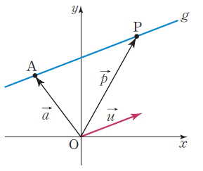

# Abstract

직선과 직선의 교차 선분과 선분의 교차에 대해 정리한다.

# Line Intersection

직선을 한점과 방향 벡터로 표현할 수 있다. 이것을 [직선의 벡터
방정식](http://koc.chunjae.co.kr/Dic/dicDetail.do?idx=22585)이라고
한다.



```
직선 g의 벡터 방정식을 구하여 보자.
p = a + tu (t는 실수)
t값을 적당히 설정하여 직선 g의 무수히 많은 점 p를
만들 수 있다는 의미이다.
두직선을 a + pb, c + qd라고 하자.
(a, b, c, d는 vector, p, q는 실수)
교차 점은 다음과 같이 표현 할 수 있다.
a + pb = c + qd

```

다음은 언급한 내용을 구현한 것이다.

```cpp
```

# Segment Intersection


```cpp
```

# Segment Intersection without cross point

```cpp
```


# References

* [직선의 벡터방정식 @ 천재학습백과](http://koc.chunjae.co.kr/Dic/dicDetail.do?idx=22585)
