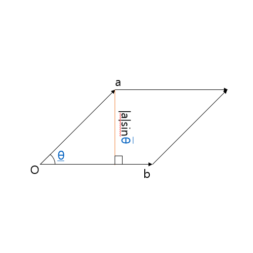
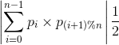

# Abstract

다각형의 면적을 구해 보자.

# Idea

`a = (x_{1}, y_{1})`, `b = (x_{2}, y_{2})` 일때 a와 b의 외적은 다음과
같다. 만약 b의 위치벡터가 a의 위치벡터의 반시계 방향에 있다면 외적의 값은 양수이고
그렇지 않다면 음수이다.



```
a x b = x_{1} * y_{2} - y_{1} * x_{2}
      = |a||b|sinθ
|a|sinθ 는 원점, a, b를 꼭지점으로 하는 삼각형의 높이다.
언급한 삼각형의 넓이를 S라 한다면

S = a x b * 0.5
```

다각형을 구성하는 점들을 `p_{i}`라고 하자. (0 <= i < n)
원점에서 언급한 점들을 연결하여 위치벡터들의 외적을
모두 합하여 더하고 절반을 취하면 다각형의 면적과 같다.



```
\left | \sum_{i=0}^{n-1} p_{i}  \times p_{(i+1) \% n}\right | \frac{1}{2}
```


# Implementation

```cpp
#include <vector>
#include <cstdio>
#include <cmath>
#include <string>

const double PI = 2.0 * acos(0.0);

struct vector2 {
  double   x, y;
  explicit vector2(double x_ = 0, double y_ = 0) : x(x_), y(y_) {}
  bool operator == (const vector2& rhs) const {
    return x == rhs.x && y == rhs.y;
  }
  // ???
  bool operator < (const vector2& rhs) const {
    return x != rhs.x ? x < rhs.x : y < rhs.y;
  }
  vector2 operator + (const vector2& rhs) const {
    return vector2(x + rhs.x, y + rhs.y);
  }
  vector2 operator - (const vector2& rhs) const {
    return vector2(x - rhs.x, y - rhs.y);
  }
  vector2 operator * (double rhs) const {
    return vector2(x * rhs, y * rhs);
  }
  double norm() const { return hypot(x, y); }
  vector2 normalize() const {
    return vector2(x / norm(), y / norm());
  }
  // angle from x-axis ccw (count clock wise)
  double polar() const {
    return fmod(atan2(y, x) + 2 * PI, 2 * PI);
  }
  double dot(const vector2& rhs) const {
    return x * rhs.x + y * rhs.y;
  }
  double cross(const vector2& rhs) const {
    return x * rhs.y - rhs.x * y;
  }
  // a vector projected to this vector
  vector2 project(const vector2& rhs) const {
    vector2 r = rhs.normalize();
    return r * r.dot(*this);
  }
  double howmuchcloser(vector2 p, vector2 a, vector2 b) {
    return (b - p).norm() - (a - p).norm();
  }
  // positive number for ccw b from a
  // negative number for cw b from a
  double ccw(vector2 a, vector2 b) {
    return a.cross(b);
  }
  double ccw(vector2 p, vector2 a, vector2 b) {
    return ccw(a-p, b-p);
  }
    
  std::string tostring() const {
    char buf[32] = {0, };
    snprintf(buf, sizeof(buf), "(%0.2lf, %0.2lf)", x, y);
    return buf;
  }
};

int solve(const std::vector<vector2>& p) {
  double r = 0;
  for (int i = 0; i < p.size(); ++i) {
    int j = (i + 1) % p.size();
    r += p[i].x * p[j].y - p[j].x * p[i].y;
  }
  return fabs(r) / 2.0;
}
```

# Time Complexity

O(N)

# References

* [Area of a polygon with given n ordered vertices @ geeksforgeeks](http://www.geeksforgeeks.org/area-of-a-polygon-with-given-n-ordered-vertices/)
