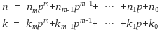
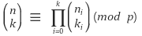
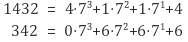
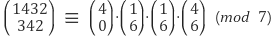

# Abstract

이항계수를 구하기 위한 여러가지 방법들 중 뤼카의 정리를 정리해 본다.

[binomial cofefficient @ TIL ](dynamic_binomial_coefficient.md)

# Idea

이항계수의 공식은 다음과 같다.


```
\begin{align*}
\binom{n}{r} &= \ _{n}C_{r} \\
\binom{n}{r} &= \frac{n!}{(n-r)!r!} \\
\binom{n}{r} &= \binom{n-1}{r-1} \binom{n-1}{r} \\
\end{align*}
```

100 C 50의 답은 100891344545564193334812497256이다.
long long 으로도 overflow를 막을 순 없다.
나머지 연산자를 다음과 같이 사용할 수 밖에 없다.


```
\binom{n}{r} \mod m = ( \left( \binom{n-1}{r-1} \mod m \right )  + \left( \binom{n-1}{r} \mod m \right) ) \mod m
```

그러나 n = 1000000000, r = 500000000 인 경우
nCr을 연산하는데 매우 긴 시간이 걸릴 것이다.

그래서 다음과 같은 뤼카의 정리를 이용하여 시간복잡도와
공간복잡도를 개선해 보자.





예를 들어 1432 C 342 % 7 의 경우를 살펴보자.





n_{i} < m_{i} 이면 n_{i} C m_{i}는 0으로 취급하자.
그 이유는 증명을 통해 이해해야 한다. 어렵다.

다음은 앞서 언급한 알고리즘을 구현한 것이다.

```cpp
// Copyright (C) 2017 by iamslash

#include <cstdio>
#include <algorithm>

// pascal triangle
int nCr_dp(int n, int r, int p) {
  int C[r+1] = {0,};
  C[0] = 1; // top row of pascal triangle
  for (int i = 1; i <= n; ++i) {
    for (int j = std::min(i, r); j > 0; --j) {
      // nCj = (n-1)Cj + (n-1)C(j-1)
      C[j] = (C[j] + C[j-1]) % p;
    }
  }
  return C[r];
}

int nCr_lucas(int n, int r, int p) {
  // base condition
  if (r == 0)
    return 1;

  // recursion
  int ni = n % p;
  int ri = r % p;
  return (nCr_lucas(n/p, r/p, p) *
          nCr_dp(ni, ri, p)) % p;  
}

int main() {
  int n = 1000;
  int r = 900;
  int p = 13;
  printf("%d\n", nCr_lucas(n, r, p));
  return 0;
}
```

# References

* [lucas theorem @ geeksforgeeks](http://www.geeksforgeeks.org/compute-ncr-p-set-2-lucas-theorem/)
* [나머지 연산의 곱셈 역원 @ acmicpc.net](https://www.acmicpc.net/blog/view/29)
