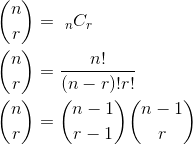
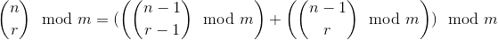
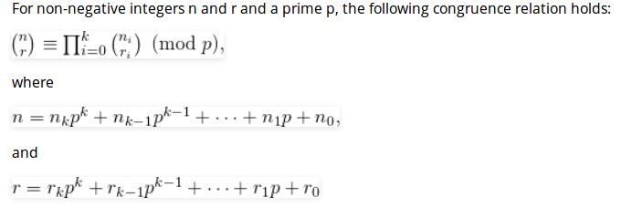

# Abstract

이항계수를 구하기 위해 여러가지 방법을 이용해 보자.
특히 뤼카의 정리에 대해 적어본다.

# Idea

n이 100이고 r이 50일때 이항계수를 구해보자.

## 파스칼의 삼각형을 이용한 방법

다음은 nCr의 공식이다.



```
\begin{align*}
\binom{n}{r} &= \ _{n}C_{r} \\
\binom{n}{r} &= \frac{n!}{(n-r)!r!} \\
\binom{n}{r} &= \binom{n-1}{r-1} \binom{n-1}{r} \\
\end{align*}
```

100 C 50의 답은 100891344545564193334812497256이다.
long long 으로도 overflow를 막을 순 없다.
나머지 연산자를 다음과 같이 사용할 수 밖에 없다.



```
\binom{n}{r} \mod m = ( \left( \binom{n-1}{r-1} \mod m \right )  + \left( \binom{n-1}{r} \mod m \right) ) \mod m
```

다음은 overflow를 막기 위해 위의 공식을 구현한 것이다.
이항계수를 표현하기 위한 파스칼의 삼각형과 나머지 연산자를 이용하였다.

```cpp
// in every line first value is always 0 + 1 pattern
// C[1] = C[1] + C[0] = 0 + 1 = 1
//   C[2] = C[2] + C[1] = 0 + 1 = 1
//   C[1] = C[1] + C[0] = 1 + 1 = 2
//     C[3] = C[3] + C[2] = 0 + 1 = 1
//     C[2] = C[2] + C[1] = 2 + 1 = 3
//     C[1] = C[1] + C[0] = 2 + 1 = 3
// pascal triangle
int nCr_dp(int n, int r, int p) {
  int C[r+1] = {0,};
  C[0] = 1; // top row of pascal triangle
  for (int i = 1; i <= n; ++i) {
    for (int j = std::min(i, r); j > 0; --j) {
      // nCj = (n-1)Cj + (n-1)C(j-1)
      C[j] = (C[j] + C[j-1]) % p;
    }
  }
  return C[r];
}
```

## 뤼카의 정리를 이용한 방법

그러나 n = 1000000000, r = 500000000 인 경우
nCr을 연산하는데 매우 긴 시간이 걸릴 것이다.

그래서 다음과 같은 뤼카의 정리를 이용하여 시간복잡도와
공간복잡도를 개선해 보자.



다음은 앞서 언급한 알고리즘을 구현한 것이다.

```cpp
// Copyright (C) 2017 by iamslash

#include <cstdio>
#include <algorithm>

// pascal triangle
int nCr_dp(int n, int r, int p) {
  int C[r+1] = {0,};
  C[0] = 1; // top row of pascal triangle
  for (int i = 1; i <= n; ++i) {
    for (int j = std::min(i, r); j > 0; --j) {
      // nCj = (n-1)Cj + (n-1)C(j-1)
      C[j] = (C[j] + C[j-1]) % p;
    }
  }
  return C[r];
}

int nCr_lucas(int n, int r, int p) {
  // base condition
  if (r == 0)
    return 1;

  // recursion
  int ni = n % p;
  int ri = r % p;
  return (nCr_lucas(n/p, r/p, p) *
          nCr_dp(ni, ri, p)) % p;  
}

int main() {
  int n = 1000;
  int r = 900;
  int p = 13;
  printf("%d\n", nCr_lucas(n, r, p));
  return 0;
}
```

## 페르마의 소정리를 이용한 방법

그러나 페르마의 소정리를 이용하면 더욱 개선할 수 있다.

```
nCr 을 빠르게 구해보자.
overflow를 막기위해 소수 p를 이용한다.
nCr = n! / (n-r)! * r! % p
이때 a = n!, b = (n-r)! * r!이라고 하면
nCr = a / b % p 
    = a * b^{p-2} % p (페르마의 소정리)
```

앞서 언급한 알고리즘의 구현은 다음과 같다.

```cpp
#include <iostream>
using namespace std;
long long mul(long long x, long long y, long long p) {
    long long ans = 1;
    while (y > 0) {
        if (y%2 != 0) {
            ans *= x;
            ans %= p;
        }
        x *= x;
        x %= p;
        y/=2;
    }
    return ans;
}
int main() {
    long long n,r,p;
    cin >> n >> r;
    p = 1000000007LL;
    long long ans = 1;
    long long t1 = 1;
    long long t2 = 1;
    for (long long i=1; i<=n; i++) {
        t1 *= i;
        t1 %= p;
    }
    for (long long i=1; i<=r; i++) {
        t2 *= i;
        t2 %= p;
    }
    for (long long i=1; i<=n-r; i++) {
        t2 *= i;
        t2 %= p;
    }
    long long t3 = mul(t2,p-2,p);
    t3 %= p;
    ans = t1*t3;
    ans %= p;
    cout << ans << '\n';
    return 0;
}
```

# References

* [lucas theorem @ geeksforgeeks](http://www.geeksforgeeks.org/compute-ncr-p-set-2-lucas-theorem/)
* [나머지 연산의 곱셈 역원 @ acmicpc.net](https://www.acmicpc.net/blog/view/29)
