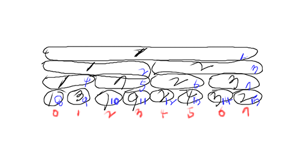

# Problem

숫자들을 저장한 일차원 배열에서 특정 구간의 최소 값을 [구간트리](tree_segment_tree.md)를
이용하여 찾아보자.

# Idea

이러한 문제를 RMQ (range minimum query) 라고 부른다.

먼저 입력데이터를 구간트리로 제작해야 한다. 구간트리 RMQ는 다음과 같이 구현한다.

```cpp
struct RMQ {
  int m_n;
  std::vector<int> m_rangemin;
  explicit RMQ(const std::vector<int>& v) {
    m_n = v.size();
    m_rangemin.resize(m_n * 4);
    init(v, 0, m_n - 1, 1);
  }

  // vleft: left index of v
  // vright: right index of v
  // rmidx: index of m_rangemin
  int init(const std::vector<int>& v, int vleft, int vright, int rmidx) {
    // base condition
    if (vleft == vright)
      return m_rangemin[rmidx]= v[vleft];

    // recursion
    int vmid = (vleft + vright) / 2;
    int leftmin = init(v, vleft, vmid, rmidx * 2);
    int rightmin = init(v, vmid + 1, vright, rmidx * 2 + 1);

    return m_rangemin[rmidx] = std::min(leftmin, rightmin);
  }

  int query(int vleft, int vright) {
    return query(vleft, vright, 1, 0, m_n - 1);
  }

  // qvleft: query left index of vector
  // qvright: query right index of vector
  // rmidx: range min index
  int query(int qvleft, int qvright, int rmidx,
            int vleft, int vright) {
    // base condition
    if (qvright < vleft || vright < qvleft)
      return MAX_INT;
      if (qvleft <= vleft && vright <= qvright)
      return m_rangemin[rmidx];

    // recursion
    int vmid = (vleft + vright) / 2;
    return std::min(query(qvleft, qvright, rmidx * 2, vleft, vmid),
                    query(qvleft, qvright, rmidx * 2 + 1, vmid + 1, vright));
  }

  int update(int vidx, int newvalue) {
    return update(vidx, newvalue, 1, 0, m_n - 1);
  }

  int update(int vidx, int newvalue, int rmidx, int vleft, int vright) {
    // base condition
    // vidx is out of range between vleft and vright
    if (vidx < vleft || vidx > vright)
      return m_rangemin[rmidx];
    if (vleft == vright)
      return m_rangemin[rmidx] = newvalue;

    // recursion
    int vmid = (vleft + vright) / 2;
    return m_rangemin[rmidx] = std::min(
        update(vidx, newvalue, rmidx * 2, vleft, vmid),
        update(vidx, newvalue, rmidx * 2 + 1, vmid + 1, vright));
  }
};
```



위 그림은 입력데이터를 `(1, 3, 7, 9, 2, 4, 3, 2)`로 했을때
만들어진 구간트리이다. 파란색 숫자는 구간트리 배열의 인덱스이고
빨간색 숫자는 입력데이터 배열의 인덱스이다.

init은 입력데이터를 이용하여 구간트리 배열을 재귀적으로
채운다. 채워지는 순서를 위그림의 파란색 숫자로 나타내면 
`(8,9,4,10,11,5,2,12,13,6,14,15,7,3,1)`과 같다. 

rmidx는 구간트리 배열의 인덱스이고 vleft, vright는 rmidx의 값에
대응하는 입력데이터의 구간을 의미한다.  구간트리의 모든 노드의 개수는
`4N`이기 때문에 init의 시간복잡도는 `O(N)`이다.

query는 입력데이터의 특정한 구간의 최소 값을 재귀적으로 얻어온다.
qvleft, qvright는 입력데이터의 특정한 구간이고 rmidx는 구간트리
배열의 인덱스이다. vleft, vright는 rmidx의 값에 대응하는
입력데이터의 구간을 의미한다.

[qvleft, qvright] 를 질의 구간이라고 하고 [vleft, vright] 담당
구간이라고 하자.  질의 구간과 담당 구간의 관계는 총 3가지 경우가
가능하다.  첫번째는 질의 구간과 담당 구간이 전혀 겹치지 않는 경우이고
두번째는 질의 구간이 담당 구간을 포함하는 경우이고 세번째는 질의
구간이 담당 구간과 일부 겹치는 경우이다.

첫번째의 경우는 질의 구간과 담당 구간이 전혀 상관없기 때문에 상위
함수의 min에서 걸러지기 위해 아주 큰값을 리턴한다.  두번째의 경우는
담당 구간의 최소값만 리턴해도 상위 함수의 min에서 처리 가능하다.
세번째의 경우는 다시 재귀적으로 해결한다.

update는 입력데이터의 특정한 값을 재귀적으로 변경한다. 이때 구간트리
배열의 관련된 값들도 같이 변경되어야 한다.

# Implementation

[c++11](../fundamentals/tree/rmq/a.cpp)

# Time Complexity

```
O(N)   : segment tree build
O(lgN) : range minimum query 
```

# Space Complexity

```
O(N)   : segment tree array
```

# References

[세그먼트트리 @ acmicpc.net](https://www.acmicpc.net/blog/view/9)
