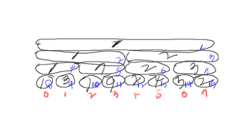

# Abstract

구간트리는 일정한 범위에 대한 연산을 빠르게 하기 위한 자료구조이다.
예를 들어서 일정한 범위에 대해 최소값 혹은 최대값을 구하거나 일정한
범위에 대해 가장 많은 빈도로 등장하는 값을 구하는 경우에 사용한다.

# Data Structure Segment Tree

N개의 입력 데이터가 있다고 하자. 이것을 구간 트리로 만들어 두면
일정한 범위에 대한 연산을 `O(lgN)` 의 시간으로 수행할 수 있다.
구간트리는 complete binary tree이다. 

complete binary tree는 마지막 level를 제외한 모든 level이
채워져 있고 마지막 level의 모든 노드들은 왼쪽으로 채워져 있다.


complete binary tree는 포인터를 이용하는 것보다 일차원 배열로 표현하는
것이 메모리를 더욱 절약 할 수 있다. [heap](tree_heap.md) 의 구현과 비슷하다.



위 그림은 입력데이터를 `(1, 3, 7, 9, 2, 4, 3, 2)`로 했을때
만들어진 구간트리이다. 파란색 숫자는 구간트리 배열의 인덱스이고
빨간색 숫자는 입력데이터 배열의 인덱스이다. leaf node를 제외한
노드는 특정 구간의 최소 값이 저장되어 있음을 주목하자.

입력 데이터의 개수가 N 이라면 구간트리 배열의 크기는 얼마로 해야할까?
입력 데이터는 구간 트리의 leaf node에 해당한다. leaf node를 제외한
node들은 구간에 대한 정보를 담고 있다. 구간 트리가 complete binary
tree이기 때문에 leaf node들의 개수는 N보다 크거나 같은 2의 승수이어야
한다. 이것을 `T`라 하면 구간트리 배열의 크기는 다음과 같다.

```
length of segment tree array = T + T - 1
                             = 2T - 1
```

complete binary tree에서 leaf node의 개수가 `T`라면 leaf node보다
레벨이 작은 녀석들의 개수는 `T-1`이다. N보다 크거나 같은 2의 승수를
찾는 것이 번거롭다면 구간트리 배열의 개수를 `4N`으로 해도 좋다.

구간트리를 제작할때 `O(N)`만큼 걸리고 질의할때 `O(lgN)`만큼 걸린다.
하나의 입력 데이터에 대해 여러개의 질의가 있을때 유용하다.

루트 노드를 구간트리 배열의 1번 노드라고 하면 임의의 노드 i의 왼쪽
자손과 오른쪽 자손을 각각 `2 × i`, `2 × i + 1`이라고 할 수 있다.
언급한 계산식을 이용하여 재귀적으로 자손을 접근하면 구간트리를
수월하게 구현할 수 있다.

구간트리는 다음과 같은 함수를 소유한다. 자세한 구현은 
구간트리를 활용한 [RMQ](tree_rmq.md)를 참고하자.

```
int init(const std::vector<int>& v, int vleft, int vright, int rmidx);
int query(int vleft, int vright);
int query(int qvleft, int qvright, int rmidx, int vleft, int vright);
int update(int vidx, int newvalue, int rmidx, int vleft, int vright);
```

# Algorithm Init

## Idea


init은 입력데이터를 이용하여 구간트리 배열을 재귀적으로
채운다. 채워지는 순서를 위그림의 파란색 숫자로 나타내면 
`(8,9,4,10,11,5,2,12,13,6,14,15,7,3,1)`과 같다. 

rmidx는 구간트리 배열의 인덱스이고 vleft, vright는 rmidx의 값에
대응하는 입력데이터의 구간을 의미한다.  구간트리의 모든 노드의 개수는
`4N`이기 때문에 init의 시간복잡도는 `O(N)`이다.

## Time Complexity

```
O(N)
```

# Algorithm Query

## Idea

query는 입력데이터의 특정한 구간의 최소 값을 재귀적으로 얻어온다.
qvleft, qvright는 입력데이터의 특정한 구간이고 rmidx는 구간트리
배열의 인덱스이다. vleft, vright는 rmidx의 값에 대응하는
입력데이터의 구간을 의미한다.

[qvleft, qvright] 를 질의 구간이라고 하고 [vleft, vright] 담당
구간이라고 하자.  질의 구간과 담당 구간의 관계는 총 3가지 경우가
가능하다.  첫번째는 질의 구간과 담당 구간이 전혀 겹치지 않는 경우이고
두번째는 질의 구간이 담당 구간을 포함하는 경우이고 세번째는 질의
구간이 담당 구간과 일부 겹치는 경우이다.

첫번째의 경우는 질의 구간과 담당 구간이 전혀 상관없기 때문에 상위
함수의 min에서 걸러지기 위해 아주 큰값을 리턴한다.  두번째의 경우는
담당 구간의 최소값만 리턴해도 상위 함수의 min에서 처리 가능하다.
세번째의 경우는 다시 재귀적으로 해결한다.

## Time Complexity

```
O(lgN)
```

# Algorithm Update

## Idea

update는 입력데이터의 특정한 값을 재귀적으로 변경한다. 이때 구간트리
배열의 관련된 값들도 같이 변경되어야 한다.

## Time Complexity

```
O(lgN)
```

# Implementation

[c++11](../fundamentals/tree/rmq/a.cpp)
