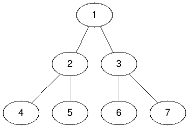

# Problem

* [Lowest Common Ancestor in a Binary Tree @ geeksforgeeks](https://practice.geeksforgeeks.org/problems/lowest-common-ancestor-in-a-binary-tree/1)

# Strategy with single traversal

## Idea

다음과 같이 부분문제 `lca`를 정의하여 재귀적으로 해결해보자.

```
lca(p, lv, rv)

lv     - 왼쪽 자식노드의 값
rv     - 오른쪽 자식노드의 값
p      - lv, rv를 검색할 서브트리의 root
return - p노드를 root로 하는 서브트리의 lca
```

`lca`는 `p`를 root로 하는 서브트리의 LCA를 리턴한다.

`p`가 NULL이면 서브트리가 존재하지 않기 때문에 LCA도 없다.
따라서 NULL을 리턴한다.

`p`가 `lv`혹은 `rv`의 값을 갖고 있다면 `p`를 포함하여 부모들중에
LCA가 존재한다는 의미이기 때문에 `p`를 리턴한다.

`p`의 왼쪽, 오른쪽 자식을 루트로 하는 서브트리의 LCA를 모아서 둘다
NULL이 아니면 `p`를 포함하여 부모들중에 LCA가 존재한다는 의미이기
때문에 `p`를 리턴한다. 

`p`의 왼쪽, 오른쪽 자식을 루트로 하는 서브트리들의 LCA가 하나만
존재한다면 NULL이 아닌 LCA를 리턴한다.

`p`의 왼쪽, 오른쪽 자식을 루트로 하는 서브트리의 LCA가 모두 NULL
이면 LCA가 존재하지 않기 때문에 NULL을 리턴한다.



위의 그림과 같이 구성된 binary tree가 있다고 하고 앞서 언급한
알고리즘을 참고 하여 `lca(①, 4, 5)`를 구해보자.  원숫자는 숫자의 값을
보유한 노드를 의미하고 `:` 뒤는 해당 부분문제의 리턴값을 의미한다.

```
lca(①, 4, 5) : ②
-lca(②, 4, 5) : ②
--lca(④, 4, 5) : ④
--lca(⑤, 4, 5) : ⑤
-lca(③, 4, 5) : NULL
--lca(⑥, 4, 5) : NULL
--lca(⑦, 4, 5) : NULL
```

## Implementation

[c++11](a.cpp)

## Time Complexity

```
O(N)
```

## Space Complexity

```
O(lgN) : call stack
```


# Strategy with RMQ

## Idea

하나의 입력데이터에 다수의 질의가 존재하는
경우라면 [RMQ](/doc/tree_rmq.md)를 이용하여 각 질의 마다 `O(lgN)`의
시간으로 해결할 수 있다.

## Implementation

[c++11](b.cpp)

## Time Complexity

```
O(N)   : build segment tree
O(loN) : query 
```

# References

* [Lowest Common Ancestor in a Binary Tree | Set 1 @ geeksforgeeks](https://www.geeksforgeeks.org/lowest-common-ancestor-binary-tree-set-1/)
* [Find LCA in Binary Tree using RMQ @ geeksforgeeks](https://www.geeksforgeeks.org/find-lca-in-binary-tree-using-rmq/)

